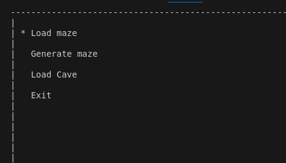
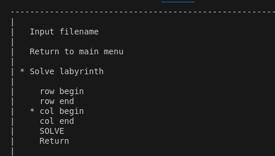
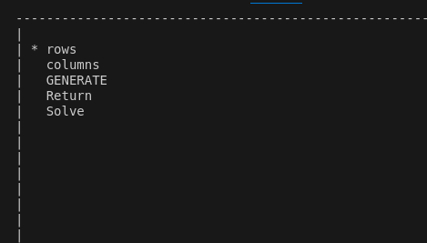
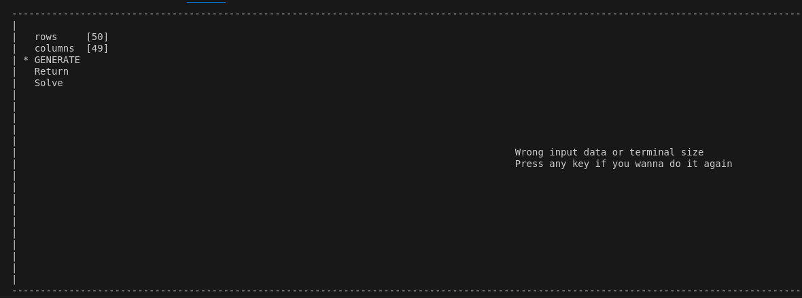
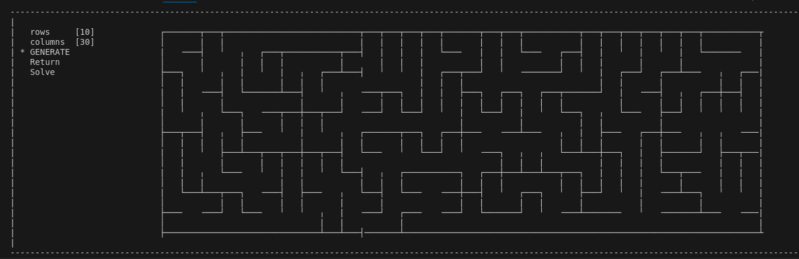
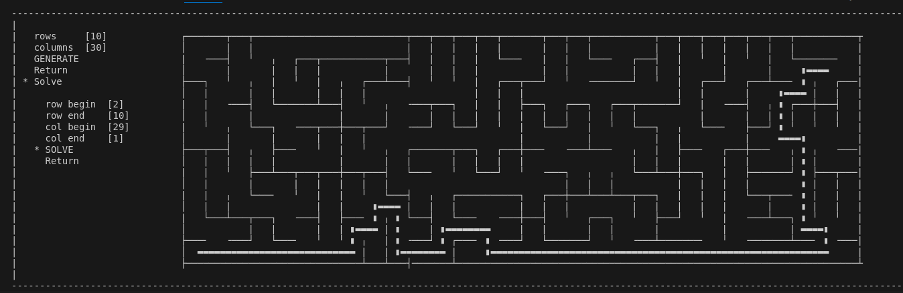

# Maze

1. [Project overview](#project-overview)
2. [Implementation, generation, solving tasks](#implementation-generation-solving-tasks)
3. [Build](#build)


## Project overview

This project implements a maze generation and solving algorithm. The goal is to create a maze with a given size and complexity, and then find the shortest path from a starting point to an ending point using solve algorithm.

### Features
- Ui written with ncursesw lib
- Load maze and generate maze submenus



Image 1 - Main menu



Image 2 - Load menu



Image 3 - Generate menu

- Support for different maze sizes (up to 50x50)

- When generating maze, file my_maze.txt is created
- If size of terminal isnt enough you will get error message. To resolve it you need to increase terminal size or make its font smaller (ctrl '-') in main menu.







## Implementation, generation, solving tasks

### Maze description

The maze can be stored in a file as a number of rows and columns, as well as two matrices containing the positions of vertical and horizontal walls respectively.

The first matrix shows the wall to the right of each cell, and the second - the wall at the bottom.

An example of such a file:
```
4 4
0 0 0 1
1 0 1 1
0 1 0 1
0 0 0 1

1 0 1 0
0 0 1 0
1 1 0 1
1 1 1 1
```


### Part 1. Implementation of the Maze project

You need to implement a Maze program that can generate and render perfect mazes and caves:
- The program must be developed in C language
- When writing a program, you must use the standard code writing style for the selected language
- The program code must be located in the src folder
- The program must be built with Makefile which contains standard set of targets for GNU-programs: all, install, uninstall, clean, tests. Installation directory could be arbitrary, except the building one
- The program should implement a console-based user interface
- The program has an option to load the maze from a file, which is set in the format described above
- Maximum size of the maze is 50x50
- The loaded maze must be rendered on the screen in the console in pseudo-graphics
- "Wall" thickness is 1 character
- The size of the maze cells themselves is calculated so that the maze occupies the entire field allotted to it.

### Part 2. Generation of a perfect maze

Add the ability to automatically generate a perfect maze. \
A maze is considered perfect if it is possible to get from each point to any other point in exactly one way.
- You must generate the maze according to **Eller's algorithm**
- The generated maze must not have isolations and loops
- Prepare full coverage of the perfect maze generation module with unit-tests
- The user enters only the dimensionality of the maze: the number of rows and columns
- The generated maze must be saved in the file format described above
- The created maze should be displayed on the screen as specified in the first part

### Part 3. Solving the maze

Add the ability to show the solution to _any_ maze currently shown on the screen:
- The user sets the starting and ending points
- The route, which is the solution, must be displayed with "a line" 1 character thick, passing through the middle of all the cells in the maze through which the solution runs.
- The color of the solution line must be different from the color of the walls, and the field
- Prepare full coverage of the maze solving module with unit-tests


## Build

Prerequisites

- make
- ncurses and ncursesw lib 
```c++ 
sudo apt-get install libncursesw5-dev
```


To build program go to `src` dir in terminal and execute command `make` 