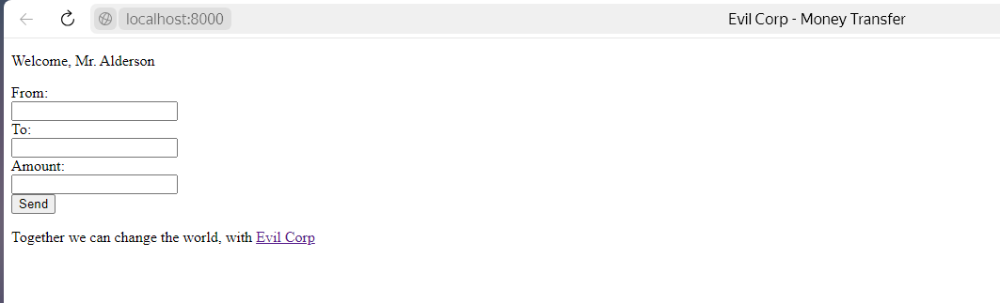

## EX00:

1) cd materials/
2) `py -m http.server`
3) open browser `http://localhost:8000/evilcorp.html`

    
4) `py exploit.py` - `/materials/evilcorp.html` changes to `/materials/evilcorp_hacked.html`

    

5) repeat steps 1,2
6) open browser `http://localhost:8000/evilcorp_hacked.html`

    


---
## EX01
1) install `redis`
2) run `redis-server` in first terminal / PowerShell

3) run `python consumer.py -e 2222222222,4444444444` in second terminal
4) run `py producer.py` in third terminal several times, each time you can change data inside producer.py 

---

## EX02

1) cd EX02/
2) py `gen_ansible.py` to generate `deploy.yml` from `../../materials/todo.yml`
3) Не обязательно: попробовать запустить на виртуалках

    ### Пример на виртуальных машинах
    1) Создать 2 виртуальных машины - основная и управляемая
    2) Задать в настройках виртуалки "Сеть - Виртуальный адаптер хоста" 
        задаст уникальные ip в одной сети
        не позволит подключаться к внешней сети интернет
        но можно взаимводействовать между виртуальными машинами

        `192.168.56.101`  - first

        `192.168.56.102`  - second
    3) Установить Ansible на основную машину
    4) Установи ssh на обе машины (придется изменить адаптер на nat в настройках виртуалки чтобы скачать с интернета): 

        `sudo apt install openssh-server`

        
    5) Измени IP если нужно:

        `sudo nano /etc/netplan/...`

        `sudo netplan apply`
    6) на основной сгенерируй ключ: **ssh-keygen**
    7) Скопировать ключи на вторую машину: 

        `ssh-copy-id user@192.168.56.102`

        **user** - имя пользователя на второй машине, а не имя второй машины
    8) Проверить подключение можно: 
        
        `ssh user@192.168.56.102`
    9) Чтобы скопировать файлы с основной машины на виртуальную:
        
        `scp consumer.py user@192.168.56.101:~` - скачается в корневую папку 
    10) Создать файл **inventory** с адресами машин
        ```inventory
        [hosts]
        192.168.56.102 ansible_user=user
        ```
    11) Написать **playbook** и запустить:

        `ansible-playbook -i inventory deploy.yml --ask-become-pass`
    
        `-i`  - подключить inventory,  `--ask-become-pass` - запрашивать пароль sudo


    #### Скачать Ansible

    На главную машину:

    `sudo apt update && sudo apt -y install software-properties-common`

    офф репо Ansible:

    `sudo add-apt-repository --yes --update ppa:ansible/ansible`

    `sudo apt -y install ansible`

    `ansible --version`


