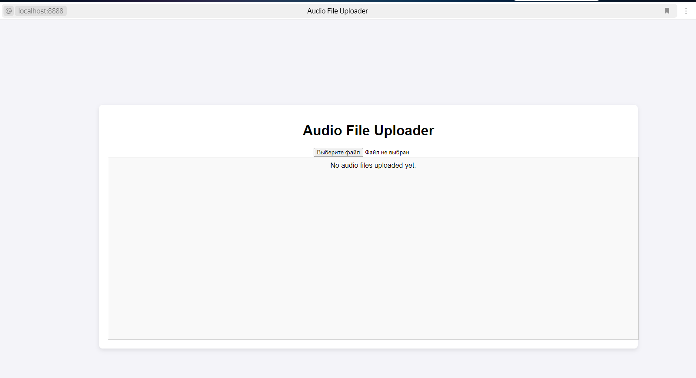
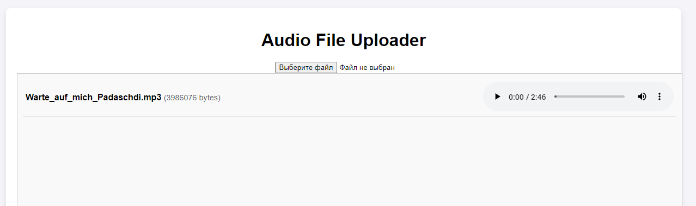
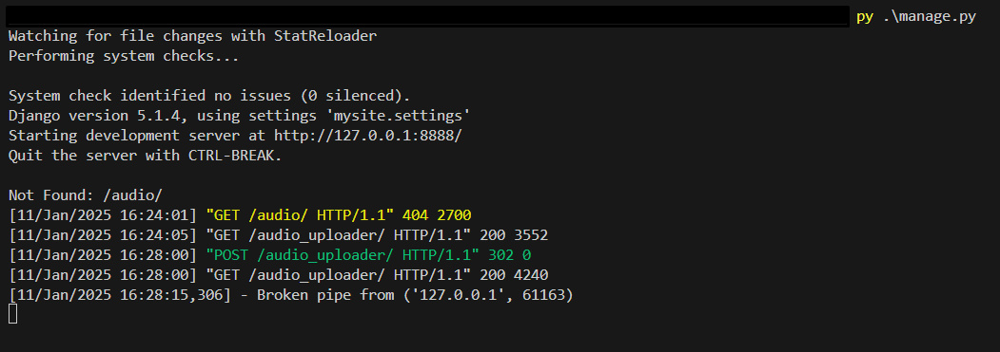
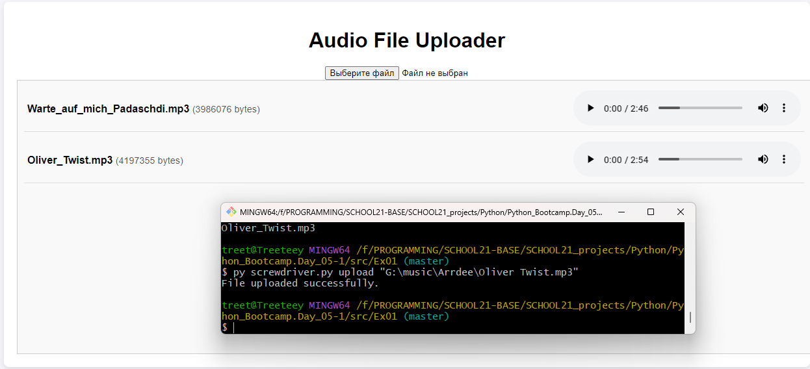
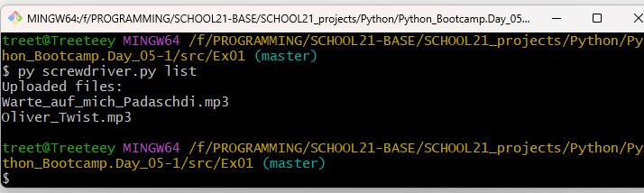

## Exercise 00: Fool Me Once

To run app:
1) cd Ex00
1) run script   `py .\credentials.py`
2) in browser enter: `http://localhost:8888/?species=Time Lord`
    or in terminal: `curl http://127.0.0.1:8888/?species=Time%20Lord`

## Exercise 01: Screwdriver Song

To run server:
1) `cd Ex01/django`
2) run script `py manage.py`
3) open browser `http://localhost:8888/audio_uploader`

4) you can upload files that will be placed in `django/audio`

5) play audio files inside web page
6) server will show requests

---
To run as client:
1) run server as described above
2) open terminal and run script `py screwdriver.py upload "path\to\file"`
3) open browser `http://localhost:8888/audio_uploader` and you will see this file in web page

4) open terminal and run script `py screwdriver.py list`
this will show list of audio files uploaded on server

## Exercise 02: Good Timing