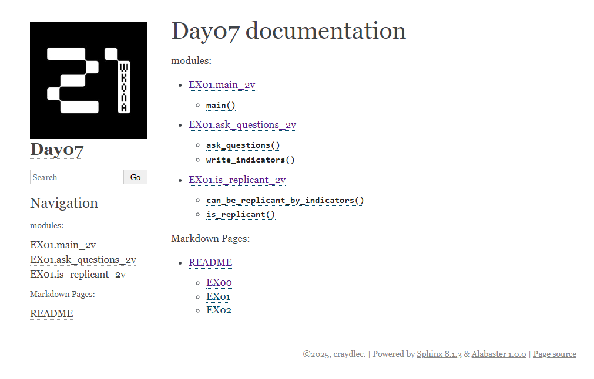

# README

## EX00

1) `cd EX00`
2) `py main.py`
3) На каждый вопрос введи номер ответа
4) Дальше "проверяющий" должен ввести через пробел 4 числа
5) В конце теста выведется: `True` или `False`

## EX01

1) `cd tests`
2) `pip install pytest`
3) `pytest`

## EX02

1) `pip install myst-parser`   
2) `cd docs`
3) `make html`
4) `.\_build\html\index.html`  - this will run `.html. file in browser
